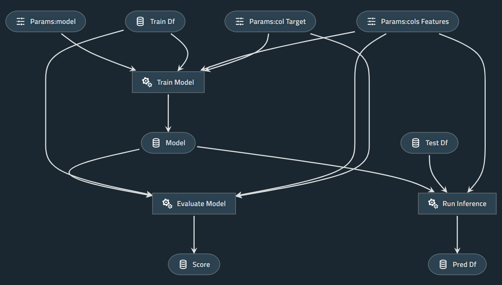

# PipelineX Scikit-learn

A Simple example project using [PipelineX](https://github.com/Minyus/pipelinex), Kedro, and Scikit-learn

<p align="center">

Pipeline visualized by Kedro-viz
</p>


## 0: Download `train.csv` and `test.csv` from [Kaggle Titanic](https://www.kaggle.com/c/titanic/data) to `data/input` directory

## 1. Install dependencies

```bash
$ pip install pipelinex kedro scikit-learn pandas mlflow kedro-viz
```

Note: `mlflow` and `kedro-viz` are optional.

## 2. Clone this repository and run `main.py`

```bash
$ git clone https://github.com/Minyus/pipelinex_sklearn.git
$ cd pipelinex_sklearn
$ python main.py
```

## Tested environment

- Python 3.6.8
