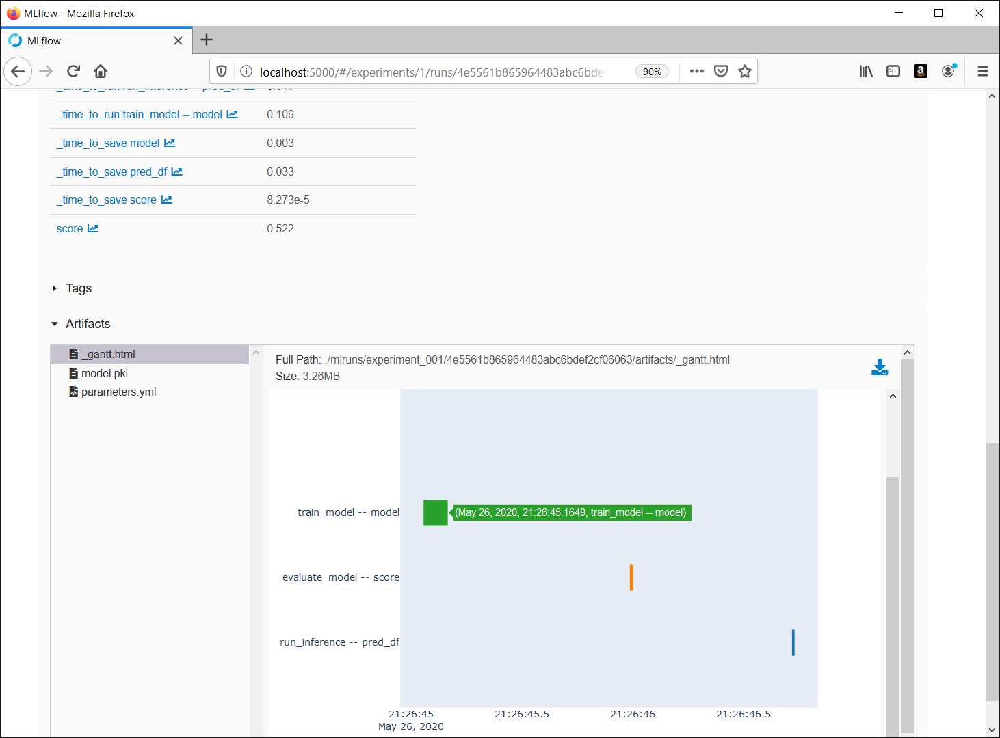

# PipelineX Scikit-learn (Basic full-YAML example of PipelineX)

A simple example project using Kedro, MLflow, and [PipelineX](https://github.com/Minyus/pipelinex) to run Scikit-learn tasks.
If you are not a YAML lover, you may prefer [limited-YAML version](https://github.com/Minyus/kedro_mlflow).

<p align="center">

Pipeline visualized by Kedro-viz
</p>


## How to run:


### 1. Install dependencies

```bash
$ pip install kedro scikit-learn pandas pipelinex mlflow plotly kedro-viz 
```

Note: `plotly` and `kedro-viz` are for visualization.

### 2. Clone this repository and cd into it

```bash
$ git clone https://github.com/Minyus/pipelinex_sklearn.git
$ cd pipelinex_sklearn
```

### 3. Go to next step to use the Iris datasets included in this project. 

Optionally, you may dowonload another dataset such as [Kaggle Titanic](https://www.kaggle.com/c/titanic/data), replace  `train.csv` and `test.csv` in `data/input` directory, and modify `base/parameters.yml` to set parameters appropriate for the dataset.

### 4. Run `main.py`

```bash
$ python main.py
```

Alternatively, Kedro CLI can be used to run.

```bash
$ kedro run
```

### 5. [Optional] View the experiment logs in MLflow's UI 

```bash
$ mlflow server --host 0.0.0.0 --backend-store-uri sqlite:///mlruns/sqlite.db --default-artifact-root ./mlruns/experiment_001
```

<p align="center">

Experiment logs in MLflow's UI
</p>


## Tested environment

- Python 3.6.8


## Simplified Kedro project template

This project was created from the GitHub template repository at https://github.com/Minyus/pipelinex_template

To use for a new project, fork the template repository and hit `Use this template` button next to `Clone or download`.

<p align="center">

</p>
